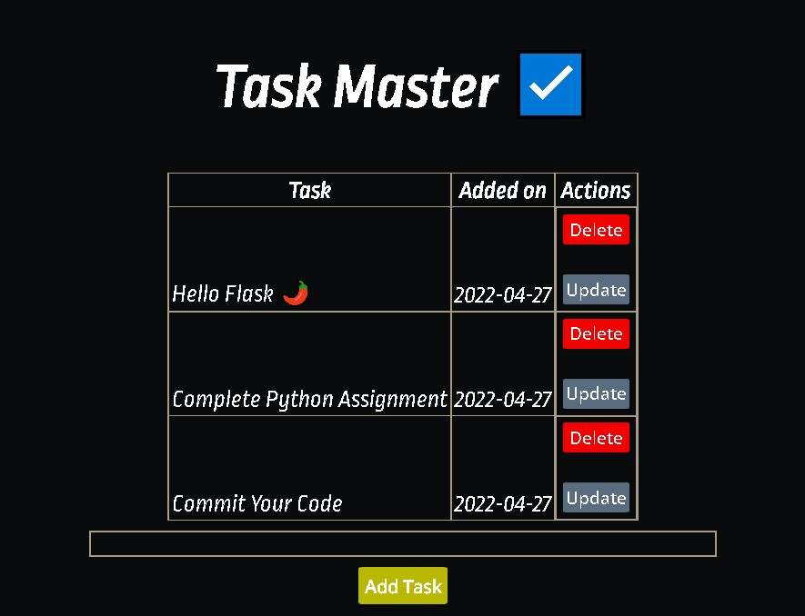
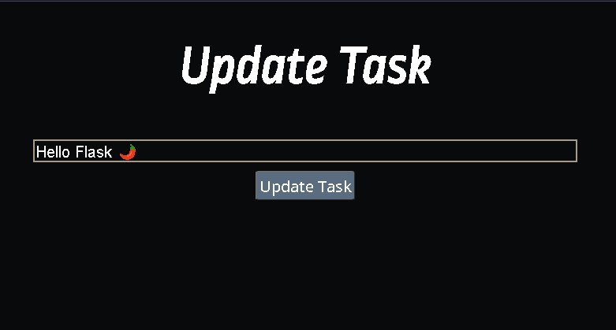

# Task Master ☑️

Task Master is web application used to make to-do lists and note down important stuff.

## Technologies

- Python
- Css3
- Html5

## Libraries used

- Flask
- SQLite3
- SQLAlchemy

## Run Locally

Clone the project

```bash
git clone https://github.com/Sayyed-Salman/Task-Master
```

Go to the project directory

```bash
cd Task-Master
```

Install dependencies

```bash
pip install -r requirments.txt
```

Or Use venv on windows

Virtual Environment (Windows)

```powershell
env/Script/Activate
```

Run Flask App

```bash
py -m flask run
```

## Screenshots




## Authors

[@SalmanSayyed](https://www.github.com/octokatherine)
